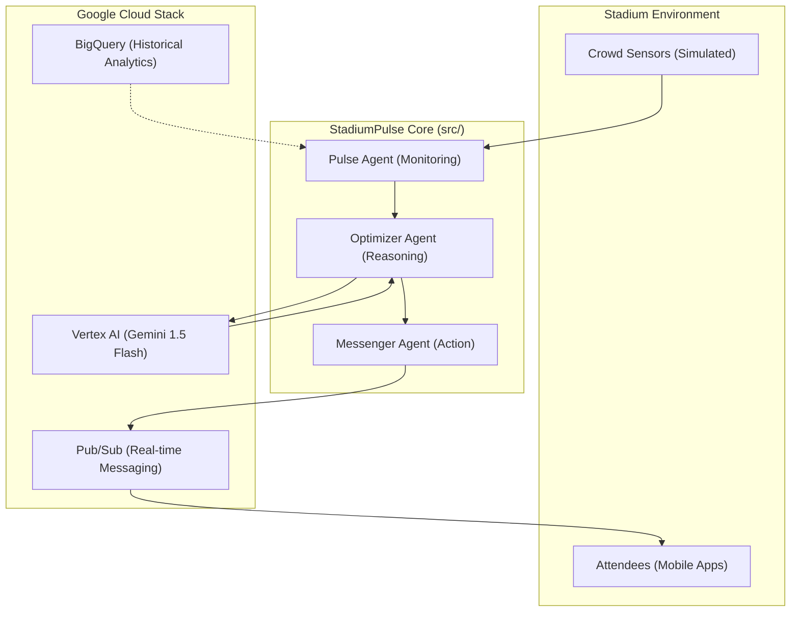

# 🏟️ StadiumPulse: Multi-Agent Crowd Orchestration

**Orchestrating stadium crowds with "Glass-Box" Agentic Reasoning.**

---

## 🌟 Project Overview
StadiumPulse is a next-generation crowd management system that replaces static rules with **Agentic Reasoning**. By observing real-time crowd signals and applying spatial analysis, the system identifies bottlenecks before they become safety hazards, performing intelligent interventions to smooth the "pulse" of the venue.

## ⚠️ Problem
Modern stadiums face extreme congestion spikes during innings breaks or match conclusions. Traditional methods lack:
1. **Strategic Anticipation**: Systems react only after congestion occurs.
2. **Contextual Reasoning**: Simple rules can't differentiate between a normal rush and a dangerous bottleneck.
3. **Closing the Loop**: There is rarely an automated feedback loop verifying if an intervention worked.

## 🏗️ Architecture
StadiumPulse is built on a modular, event-driven architecture integrated with the Google Cloud ecosystem.



## 🧠 AI Reasoning Transparency
StadiumPulse exposes the reasoning chain of its AI agents.

1. **Pulse Agent** → Scans signals to detect congestion anomalies.
2. **Optimizer Agent** → Analyzes spatial data and engages Gemini 1.5 Flash for strategic plays.
3. **Messenger Agent** → Dispatches interventions via Pub/Sub and GCF.

This **glass-box AI reasoning** design ensures every decision—from shifting fans to under-utilized gates to issuing discount-based incentives—remains observable and explainable in the operations console.

---

## 🤖 Agent System
- **Pulse Agent**: Telemetry & Anomaly Detection (Variance ≥30%).
- **Optimizer Agent**: Brain/Strategist. Triggers **Gemini 1.5 Flash** for strategic play selection when safety thresholds (>85% load) are breached.
- **Messenger Agent**: dual-dispatch (Pub/Sub + GCF) fan alerts with tone-switching (`INCENTIVE` vs `URGENCY`).

## 🧠 Gemini AI Integration
- **Threshold Trigger**: Gemini is only invoked for high-stakes decisions (Breach > 85%).
- **Strategic Caching**: Fingerprint cache minimizes redundant API calls.
- **Flash Efficiency**: Uses Gemini 1.5 Flash for high-speed, cost-effective reasoning.

## 🏟️ Multi-Venue Support
JSON-defined venue profiles for **Narendra Modi Stadium**, **Wankhede Stadium**, and **Wembley Stadium**.

## ⏱️ Demo Instructions

### 1. Prerequisites
- Python 3.10+
- `pip install -r requirements.txt`

### 2. Launch the Dashboard
The interactive demo console and step-by-step scenario walkthrough.
```powershell
streamlit run src/app.py
```

### 3. Run the CLI Simulation (5-Minute Timeline)
```powershell
python src/main.py
```

### 4. Execute Test Suite
```powershell
python -m pytest --cov=. tests/
```

---
*Developed for the Google Cloud Agentic Coding Hackathon.*
